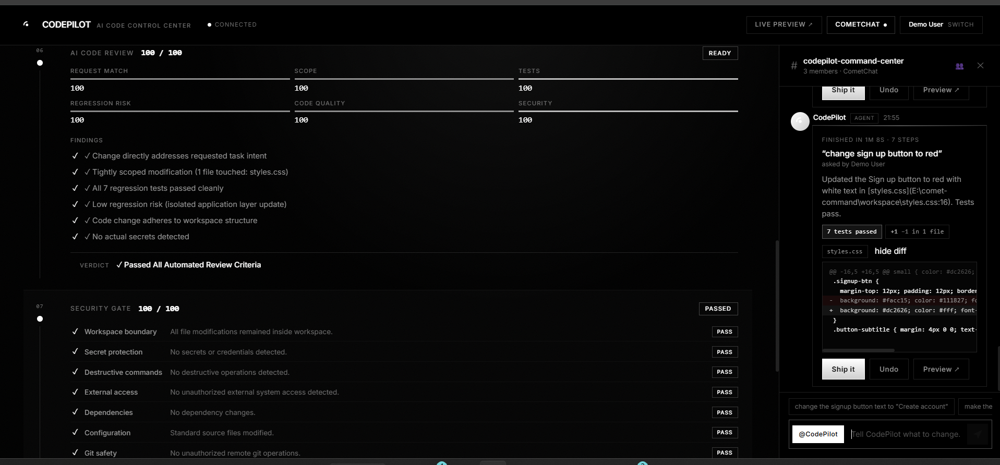
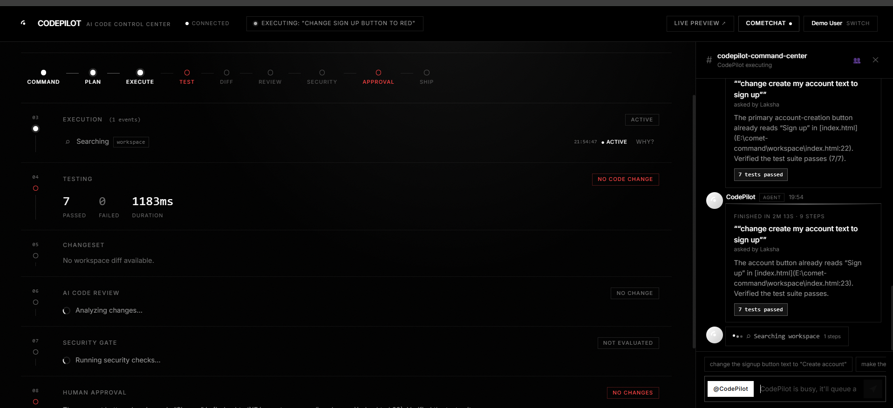
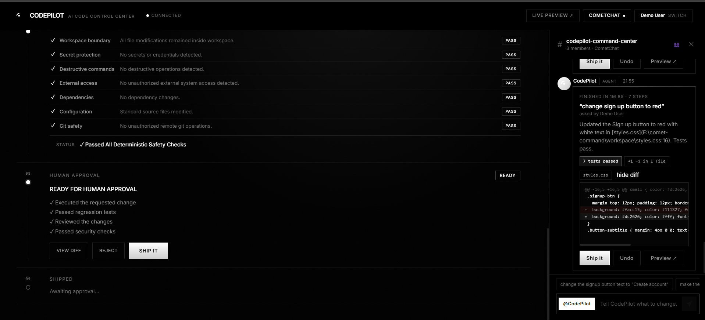
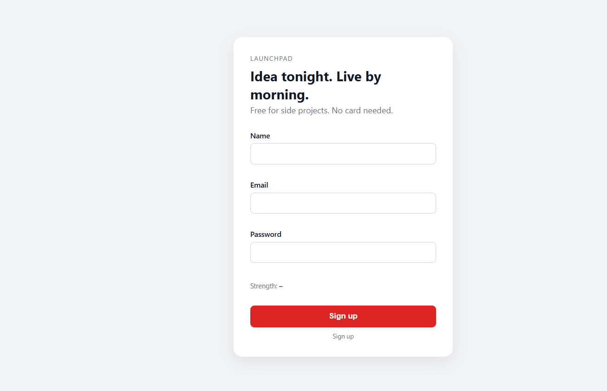
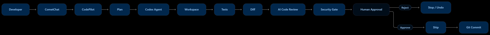

Based on the README you currently have, here is a **complete cleaned-up version** that keeps your actual CodePilot functionality and your current screenshot paths, while removing duplication and making the GitHub page more professional. Your current README already establishes the core positioning and pipeline as **Command → Plan → Execute → Test → Diff → AI Review → Security Gate → Human Approval → Ship**. Pasted text

Copy everything below into `README.md`.

```markdown
# CODEPILOT

### AI CODE CONTROL CENTER

> **AI executes. CodePilot verifies. You decide.**

CodePilot is an AI-powered software engineering control center built around **CometChat**.

Instead of giving an AI coding agent unrestricted control over a codebase, CodePilot turns software changes into a controlled engineering workflow:

**Command → Plan → Execute → Test → Diff → AI Review → Security Gate → Human Approval → Ship**

Developers issue coding requests through CometChat. CodePilot executes the request inside a controlled workspace, runs tests, analyzes the actual code diff, performs an AI code review, checks security risks, and waits for explicit human approval before shipping.

Built for the **CometChat Zero to Chat Hackathon**.

---

# Why CodePilot?

AI coding agents can already write and modify code.

The difficult question is no longer:

> **Can AI write the code?**

It is:

> **Can we safely trust AI to change real software?**

CodePilot adds a control layer between an AI coding agent and the codebase.

### Traditional AI coding workflow

```text
Developer
    ↓
AI
    ↓
Code
```

### CodePilot workflow

```text
Developer
    ↓
CometChat
    ↓
CodePilot
    ↓
Plan
    ↓
Execute
    ↓
Test
    ↓
Diff
    ↓
AI Code Review
    ↓
Security Gate
    ↓
Human Approval
    ↓
Ship
```

The AI does the work.

**CodePilot verifies the work.**

The human remains in control.

---

# Product Preview

## Main Control Center

<p align="center">
  
</p>

<p align="center">
  <sub>
    CodePilot control center for commanding, monitoring and approving AI-driven software changes.
  </sub>
</p>

---

## AI Code Review

<p align="center">
  
</p>

<p align="center">
  <sub>
    CodePilot evaluates the actual change against the original request, scope, tests, regression risk, code quality and security.
  </sub>
</p>

---

## Security Gate & Engineering Pipeline

<p align="center">
  
</p>

<p align="center">
  <sub>
    The security layer evaluates workspace boundaries, credentials, destructive operations, dependencies, configuration and Git safety.
  </sub>
</p>

---

## Human Approval

<p align="center">
  
</p>

<p align="center">
  <sub>
    CodePilot does not automatically ship a successful AI change. A human must approve the result.
  </sub>
</p>

---

## Proof of Execution

<p align="center">
  
</p>

<p align="center">
  <sub>
    Execution results, tests and change verification provide evidence of what the AI actually changed.
  </sub>
</p>

---

# How It Works

A developer sends a natural-language coding request through CometChat.

For example:

```text
@CodePilot Add a customer CSV export feature
```

CodePilot takes the request through a controlled engineering pipeline.

<p align="center">
  
</p>

The system then:

```text
COMMAND
   ↓
PLAN
   ↓
EXECUTE
   ↓
TEST
   ↓
DIFF
   ↓
AI CODE REVIEW
   ↓
SECURITY GATE
   ↓
HUMAN APPROVAL
   ↓
SHIP
```

---

# Engineering Pipeline

## 01 — COMMAND

The developer sends a natural-language engineering request through CometChat.

Example:

```text
@CodePilot Add dark mode to the dashboard
```

The request becomes the input for the current CodePilot run.

---

## 02 — PLAN

CodePilot identifies the requested change and prepares the execution workflow.

The request remains associated with the current run so the resulting changes can be evaluated against the original intent.

---

## 03 — EXECUTE

CodePilot launches the configured coding agent against the connected workspace.

The current implementation uses the **OpenAI Codex CLI** for real code execution.

The agent can inspect the repository, modify files and perform development operations within the configured workspace.

---

## 04 — TEST

After execution, CodePilot validates the workspace using the project's test workflow.

Example:

```text
TESTS

24 / 24 PASSED

STATUS
PASS
```

Test results are surfaced directly in the CodePilot control center.

---

## 05 — DIFF

CodePilot calculates the actual changes produced by the current run.

It does not simply trust an agent response saying:

```text
Done.
```

CodePilot compares the workspace state for the current run and determines whether a real change was produced.

If the agent reports success but creates no new change, CodePilot identifies the run as a **no-op** and does not present it as a shippable change.

---

## 06 — AI CODE REVIEW

CodePilot analyzes the actual change against the original request.

The review evaluates:

- Request Match
- Scope
- Test Status
- Regression Risk
- Code Quality
- Security

Example:

```text
AI CODE REVIEW

Request Match       PASS
Scope               PASS
Tests               PASS
Regression Risk     LOW
Code Quality        PASS
Security            PASS

Review: READY
```

The review layer analyzes the change and does not modify the workspace.

---

## 07 — SECURITY GATE

Before shipping, CodePilot performs a security-oriented analysis of the execution.

It evaluates areas including:

- Workspace boundary
- Credentials and secrets
- Destructive operations
- External access
- Dependency changes
- Configuration changes
- Git safety

Critical security issues can block shipping.

The goal is to prevent an AI-generated change from being treated as safe merely because the agent reported success.

---

## 08 — HUMAN APPROVAL

A successful AI execution does not automatically become a shipped change.

The developer remains responsible for the final decision.

```text
┌────────────────────────────────────┐
│ HUMAN APPROVAL                     │
│                                    │
│ Review complete                    │
│ Security gate passed               │
│ Tests passed                       │
│                                    │
│ [ REJECT ]       [ APPROVE & SHIP ]│
└────────────────────────────────────┘
```

---

## 09 — SHIP

Only after approval does CodePilot perform the final shipping action.

The resulting commit can then be inspected through Git.

If the developer rejects the change, the workflow can discard/undo the proposed modification instead of shipping it.

---

# CometChat Integration

CometChat is not simply a notification channel.

It acts as the **command and communication interface between the developer and the coding agent**.

<p align="center">
  
</p>

A developer can communicate with CodePilot using natural-language engineering commands.

Example:

```text
Developer:
@CodePilot Add a CSV export button to the customer table
```

CodePilot then executes the engineering workflow and returns the result through the control interface.

---

# Why CometChat?

CodePilot uses multiple CometChat capabilities:

| CometChat Capability | CodePilot Usage |
|---|---|
| Chat | Engineering commands |
| Groups | Project/team communication |
| Users | Developer and agent identities |
| Custom Messages | Execution and result information |
| Reactions | Approval interactions |
| Presence | Agent availability |
| Typing Indicators | Live execution feedback |
| REST API | Server-side agent communication |
| CometChat MCP | CometChat documentation and integration workflow |

The CometChat MCP integration is configured through:

```text
.mcp.json
```

---

# CometChat MCP

The project uses the **CometChat MCP** to work with CometChat's integration and documentation ecosystem.

Official CometChat MCP:

https://mcp.cometchat.com/mcp?ref=z2c

Official CometChat Developer Documentation:

https://www.cometchat.com/docs

Official CometChat Developer Platform:

https://www.cometchat.com/developers

---

# Architecture

<p align="center">
  
</p>

At a high level:

```text
                    ┌─────────────────┐
                    │    Developer    │
                    └────────┬────────┘
                             │
                             ▼
                    ┌─────────────────┐
                    │   CometChat     │
                    │ Command Layer   │
                    └────────┬────────┘
                             │
                             ▼
                    ┌─────────────────┐
                    │    CodePilot    │
                    │     Server      │
                    └────────┬────────┘
                             │
                             ▼
                    ┌─────────────────┐
                    │ Command / Run   │
                    │   Controller    │
                    └────────┬────────┘
                             │
                             ▼
                    ┌─────────────────┐
                    │   Codex Agent   │
                    └────────┬────────┘
                             │
                             ▼
                    ┌─────────────────┐
                    │    Workspace    │
                    └────────┬────────┘
                             │
              ┌──────────────┼──────────────┐
              ▼              ▼              ▼
           Tests           Diff       Execution Data
              │              │              │
              └──────────────┼──────────────┘
                             ▼
                    ┌─────────────────┐
                    │   AI Code       │
                    │     Review      │
                    └────────┬────────┘
                             │
                             ▼
                    ┌─────────────────┐
                    │ Security Gate   │
                    └────────┬────────┘
                             │
                             ▼
                    ┌─────────────────┐
                    │ Human Approval  │
                    └────────┬────────┘
                             │
                        Approved?
                         /       \
                       No         Yes
                       │           │
                       ▼           ▼
                     Undo        Ship
```

---

# Core Components

| Component | Responsibility |
|---|---|
| **CometChat UI** | Developer command and communication interface |
| **CodePilot Server** | Coordinates the engineering workflow |
| **Command Controller** | Receives and processes coding requests |
| **Codex Adapter** | Executes Codex CLI and parses execution events |
| **Workspace** | Target project being modified |
| **Test Runner** | Validates the resulting implementation |
| **Diff Engine** | Determines actual changes from the current run |
| **AI Code Review** | Evaluates implementation quality and request match |
| **Security Gate** | Detects security and execution risks |
| **Approval Layer** | Keeps humans in control of shipping |
| **Ship / Undo** | Final commit or rejection workflow |

---

# Safety Model

CodePilot is designed around one principle:

> **AI can execute. AI cannot unilaterally ship.**

### Workspace Boundary

The coding agent operates against the configured workspace.

### Human Approval

A successful execution does not automatically become a shipped change.

### No-Op Detection

If the agent reports success but produces no new code change, CodePilot identifies the run as a no-op.

### Diff-Based Review

The review system analyzes the actual change rather than blindly trusting the agent's textual response.

### Security Gate

Potentially dangerous operations can be flagged or blocked before shipping.

### Server-Side Secrets

Sensitive CometChat credentials remain server-side and are not exposed to the browser.

### Git Safety

The workflow does not treat arbitrary `git push` operations as part of normal agent execution.

---

# Technology Stack

## Frontend

- React
- Vite
- JavaScript
- CSS

## Backend

- Node.js
- Express
- CometChat REST APIs

## AI

- OpenAI Codex CLI
- Codex JSONL execution events

## Communication

- CometChat
- CometChat MCP

## Development

- Git
- GitHub
- Node.js 20+

---

# Project Structure

```text
codepilot/
│
├── server/
│   ├── agent.js
│   ├── codex.js
│   ├── codeReview.js
│   ├── securityGate.js
│   ├── brain.js
│   ├── cometchat.js
│   ├── config.js
│   ├── index.js
│   └── test/
│
├── web/
│   └── src/
│       ├── App.jsx
│       ├── components/
│       └── lib/
│
├── workspace/
│   └── ...
│
├── docs/
│   └── screenshots/
│
├── .mcp.json
├── .env.example
├── package.json
└── README.md
```

---

# Getting Started

## Requirements

Make sure you have:

- Node.js 20+
- npm
- Git
- A CometChat account
- An OpenAI Codex CLI installation
- A configured CometChat application

---

## 1. Clone the Repository

```bash
git clone https://github.com/LakshaGoyal/codepilot.git
cd codepilot
```

Repository:

https://github.com/LakshaGoyal/codepilot

---

## 2. Install Dependencies

```bash
npm run install:all
```

---

## 3. Configure Environment Variables

Create your local environment file.

### macOS / Linux

```bash
cp .env.example .env
```

### Windows PowerShell

```powershell
Copy-Item .env.example .env
```

Then configure the required values inside `.env`.

### Important

Never commit:

```text
.env
```

Never expose:

- API keys
- REST keys
- authentication tokens
- private credentials

Use `.env.example` as the configuration template.

---

# Environment Configuration

Example configuration:

```env
COMETCHAT_APP_ID=
COMETCHAT_REGION=
COMETCHAT_REST_API_KEY=

AGENT_UID=
AGENT_NAME=

GROUP_GUID=
GROUP_NAME=

HUMANS=

AGENT_MODE=poll

WORKSPACE_DIR=../workspace

PORT=8787
```

Use the actual `.env.example` in the repository as the source of truth for the current configuration.

---

# Running CodePilot

Build and start the complete application:

```bash
npm run hackathon
```

You can also use:

```bash
npm start
```

The application normally runs at:

```text
http://localhost:8787
```

---

# Development Mode

The frontend development server can be started with:

```bash
npm run dev
```

This mode is intended for frontend development.

For the complete CodePilot execution pipeline, use:

```bash
npm run hackathon
```

---

# Testing

Run the complete test suite:

```bash
npm test
```

This runs the project's server and workspace tests.

---

# Build

Build the frontend:

```bash
npm run build
```

---

# Example Engineering Requests

CodePilot is designed for natural-language engineering requests.

### Feature request

```text
@CodePilot Add CSV export to the customer table
```

### UI change

```text
@CodePilot Add dark mode to the dashboard
```

### Bug fix

```text
@CodePilot Fix the authentication test that is currently failing
```

### Refactoring

```text
@CodePilot Refactor the customer service into smaller modules
```

### More complex task

```text
@CodePilot Add role-based access control for
Admin, Manager and Employee users
```

The request is then processed through:

```text
COMMAND
   ↓
PLAN
   ↓
EXECUTE
   ↓
TEST
   ↓
DIFF
   ↓
AI REVIEW
   ↓
SECURITY
   ↓
APPROVAL
   ↓
SHIP
```

---

# What Makes CodePilot Different?

Traditional AI coding:

```text
Prompt
  ↓
AI
  ↓
Code
```

CodePilot:

```text
Prompt
  ↓
AI Execution
  ↓
Tests
  ↓
Actual Diff
  ↓
AI Code Review
  ↓
Security Gate
  ↓
Human Approval
  ↓
Ship
```

The objective is not simply to make AI write more code.

The objective is to make **AI-driven software engineering more observable, controlled and trustworthy.**

---

# CodePilot vs. a Traditional Coding Assistant

| Capability | Traditional AI Coding Assistant | CodePilot |
|---|---:|---:|
| Natural-language coding | Yes | Yes |
| Code modification | Yes | Yes |
| Automated testing | Varies | Yes |
| Actual diff verification | Varies | Yes |
| No-op detection | Varies | Yes |
| AI Code Review | Varies | Yes |
| Security Gate | Varies | Yes |
| Human approval workflow | Varies | Yes |
| Controlled shipping | Varies | Yes |
| CometChat command interface | No | Yes |

CodePilot is therefore positioned as a **control layer for AI software engineering**, rather than simply another AI code editor.

---

# Demo Flow

A concise CodePilot demonstration can follow this sequence:

```text
1. Developer sends a request through CometChat

2. CodePilot receives the command

3. Codex executes the change

4. Tests run

5. CodePilot calculates the actual diff

6. AI Code Review evaluates the change

7. Security Gate evaluates the execution

8. Developer reviews the result

9. Developer approves or rejects

10. Approved changes are shipped
```

Example:

```text
Developer
    ↓
"Add customer CSV export"
    ↓
CodePilot
    ↓
Codex modifies workspace
    ↓
Tests: PASS
    ↓
Diff generated
    ↓
AI Review: READY
    ↓
Security: PASS
    ↓
Human Approval
    ↓
SHIP
```

---

# Screenshots

Current screenshots are stored under:

```text
docs/screenshots/
```

Recommended final screenshots:

```text
docs/screenshots/
├── main1.png
├── aicode.png
├── pipeline.png
├── humanapproval.png
├── proof.png
├── mermaid-diagram.png
├── mermaid-diagram (1).png
└── mermaid-diagram (2).png
```

If you add more screenshots, keep the naming descriptive and update this README accordingly.

---

# Demo Video

Add your final hackathon demo here:

```text
YOUR_DEMO_VIDEO_URL
```

Example Markdown:

```markdown
[Watch the CodePilot Demo](YOUR_DEMO_VIDEO_URL)
```

For the CometChat hackathon, the demo should focus on the complete engineering loop:

```text
Command
→ Execution
→ Tests
→ Diff
→ AI Review
→ Security
→ Approval
→ Ship
```

---

# Links

| Resource | Link |
|---|---|
| **CodePilot GitHub** | https://github.com/LakshaGoyal/codepilot |
| **CometChat** | https://www.cometchat.com/ |
| **CometChat Developers** | https://www.cometchat.com/docs |
| **CometChat Developer Platform** | https://www.cometchat.com/developers |
| **CometChat MCP** | https://mcp.cometchat.com/mcp?ref=z2c |
| **OpenAI Codex** | https://openai.com/codex/ |

---

# Future Direction

The current implementation is centered around a configured local workspace.

A future version can expand the workspace layer to support multiple project connection methods:

```text
                    CODEPILOT
                        │
             ┌──────────┼──────────┐
             │          │          │
             ▼          ▼          ▼
        Local Project GitHub    GitLab
             │          │          │
             └──────────┼──────────┘
                        ▼
                Agent Workspace
                        │
                        ▼
                  Codex / Agent
```

Potential future capabilities include:

- GitHub repository connection
- GitLab repository connection
- Branch-based execution
- Pull request generation
- Multiple project workspaces
- Team-level permissions
- Persistent engineering sessions
- CI/CD integration
- Advanced audit logs
- Multi-agent engineering workflows

These are future directions and are not required for the current core workflow.

---

# Security

Never commit credentials or secrets to this repository.

Use environment variables for sensitive configuration.

Before pushing changes, verify that test fixtures and source files do not contain real credentials:

```bash
git status
git grep -n -i "sk_live_"
git grep -n -i "sk_test_"
git grep -n -i "ghp_"
```

Detection regexes used by the application may legitimately contain provider prefixes. Those are not credentials.

Do not bypass GitHub secret scanning for real credentials.

If a real credential is ever committed:

1. Revoke it.
2. Rotate it.
3. Remove it from Git history.
4. Verify that the replacement is safe before pushing again.

---

# Hackathon

## CometChat — Zero to Chat

CodePilot was built for the **CometChat Zero to Chat Hackathon**.

The project uses CometChat as the communication and command layer for an AI software-engineering workflow.

Instead of building another standalone coding agent interface, CodePilot turns the coding agent into a participant in a real-time communication workflow.

```text
Developer
    ↓
CometChat
    ↓
CodePilot
    ↓
AI Coding Agent
    ↓
Verification
    ↓
Human Approval
    ↓
Ship
```

---

# Built With

<p align="center">


</p>

---

# License

Add your preferred license here.

Example:

```text
MIT License
```

---

# CODEPILOT

### AI executes. CodePilot verifies. You decide.

Built for the **CometChat Zero to Chat Hackathon**.

**GitHub:**  
https://github.com/LakshaGoyal/codepilot
```

